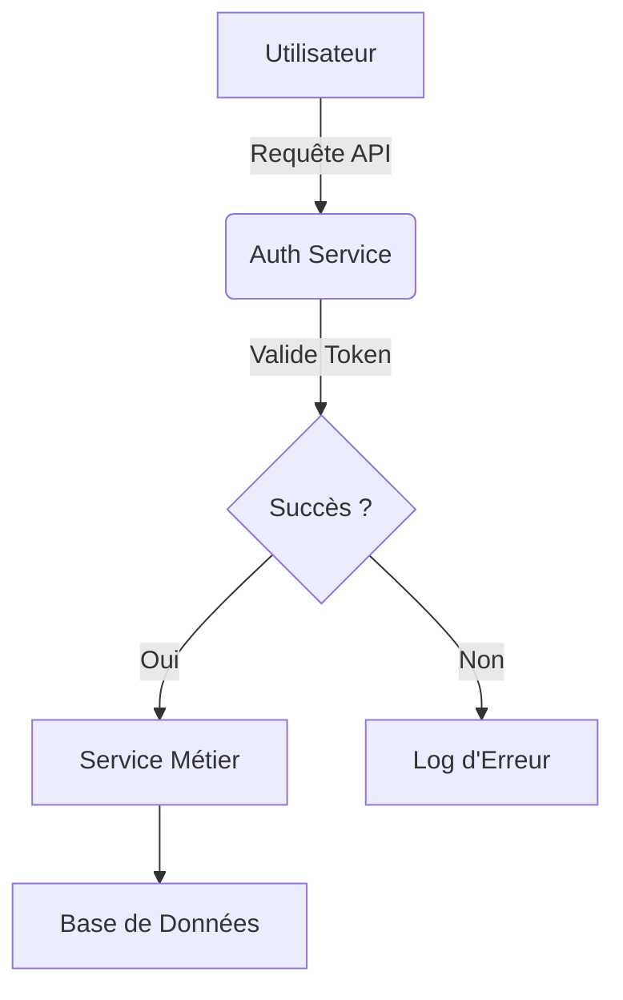
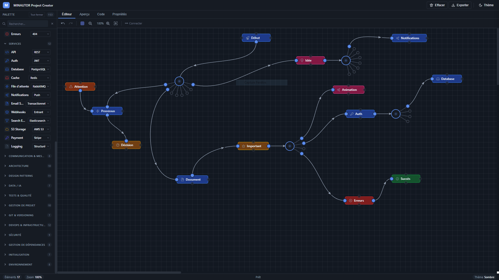
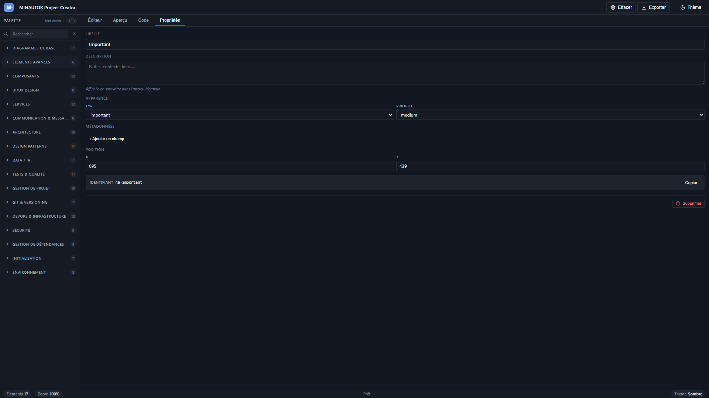

# ⚡ Minautor Project Creator ⚡

> *Concevez vos projets, sans écrire une seule ligne de code, et donnez-leur vie automatiquement.*

<p align="center">
  
</p>

<p align="center">
  <a href="https://github.com/French-Team/minautor-project-creator/stargazers">
    
  </a>
  <a href="https://github.com/French-Team/minautor-project-creator/network/members">
    
  </a>
  <a href="https://github.com/French-Team/minautor-project-creator/issues">
    
  </a>
  <a href="https://github.com/French-Team/minautor-project-creator/blob/main/LICENSE">
    
  </a>
</p>

<p align="center">
  <a href="https://vitejs.dev/">
    
  </a>
  <a href="https://mermaid.js.org/">
    
  </a>
  <a href="https://playwright.dev/">
    
  </a>
  <a href="https://vitest.dev/">
    
  </a>
</p>

---

## 🚀 Bienvenue dans l'Univers de ⚡ Minautor ⚡

Oubliez les documents statiques et les schémas déconnectés de la réalité. **Minautor Project Creator** transforme la conception de projet en une expérience visuelle, intuitive et profondément collaborative. C'est un outil puissant qui permet à quiconque — développeur, chef de projet, designer ou stratège — de modéliser des projets complexes *sans écrire une seule ligne de code*.

L'idée est aussi simple que révolutionnaire : **utiliser un canvas interactif comme outil de conception de projet**. Chaque nœud du diagramme Mermaid représente un élément tangible de votre projet (un composant, un service, une tâche, une décision...), et ses **propriétés** stockent toutes les informations métier associées. L'export génère ensuite une **documentation vivante**, toujours synchronisée avec votre vision.

### 💡 Le Cœur du Projet : Vos Idées Prendent Vie

Minautor ne se contente pas de dessiner des boîtes et des flèches. Il enrichit votre diagramme avec une **couche sémantique profonde**. Vous pouvez attacher à chaque nœud des propriétés structurées (endpoints d'API, schémas de données, responsables, statuts, critères de décision...) qui le rendent intelligent et actionnable.



*Avec Minautor, ce diagramme ne reste pas abstrait : il devient la source unique de vérité de votre projet.*

### ✨ L'Export Intelligent : Votre Documentation Vivante

Pourquoi perdre des heures à maintenir une documentation à jour ? Le moteur d'export de Minautor assemble automatiquement votre diagramme et ses propriétés en un **ensemble de documentation complet et structuré**. Exportez votre projet sous forme de **ZIP** contenant :

*   Un `README.md` synthétique avec sommaire et statistiques.
*   Des **fichiers Markdown** organisés par catégories (`architecture/`, `devops/`, `security/`, `testing/`, etc.).
*   Le **diagramme SVG** prêt à être partagé.

```text
export-mon-projet/
├── README.md                    ← Synopsis + sommaire + stats
├── diagram.svg                  ← Le diagramme Mermaid (SVG)
├── plan/                        ← arch-*, process, decision
├── components/                  ← component-*
├── devops/                      ← devops-*
├── security/                    ← sec-*
├── testing/                     ← test-*
├── project/                     ← proj-*
└── ...
```

---

## 🖼️ Un Aperçu en Images

| Éditeur Interactif | Propriétés Structurées |
| :---: | :---: |
|  |  |
| *Modélisez vos flux et architectures par glisser-déposer.* | *Enrichissez chaque nœud avec des données métier.* |

---

## 🤝 Rejoignez l'Aventure !

Minautor Project Creator est un projet open-source ambitieux, et nous sommes convaincus que **la meilleure innovation naît de la collaboration**. Que vous soyez un expert technique cherchant à repousser les limites du possible, ou un utilisateur passionné désirant améliorer l'expérience, votre contribution est inestimable.

Nous vous invitons à explorer le code, à proposer de nouvelles fonctionnalités, à signaler des bogues, ou simplement à partager vos créations. **Ensemble, construisons l'outil de conception de projet de demain.**

<p align="center">
  <a href="https://github.com/French-Team/minautor-project-creator/issues">
    
  </a>
  <a href="https://github.com/French-Team/minautor-project-creator/pulls">
    
  </a>
</p>

---

<p align="center">
  Fait avec ❤️ par <a href="https://github.com/French-Team">French-Team</a>
</p>
