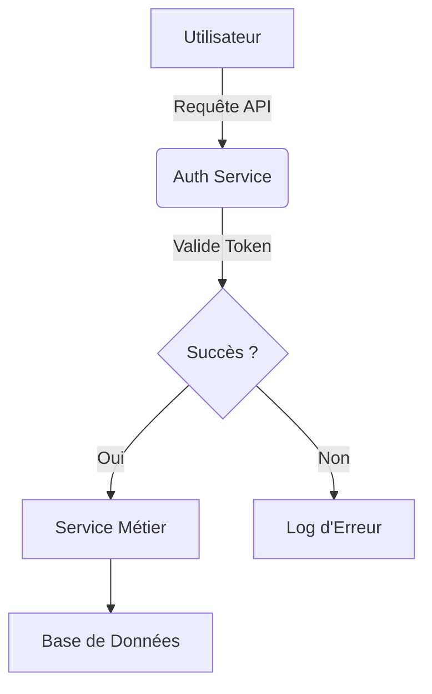
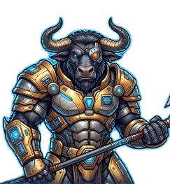
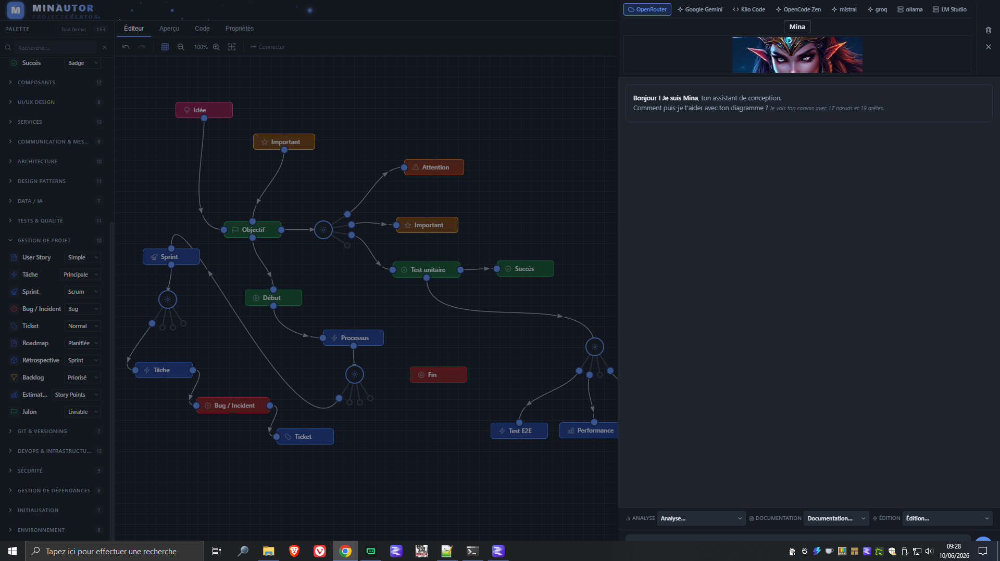

# ⚡ Minautor Project Creator ⚡

> *Concevez vos projets, sans écrire une seule ligne de code, et donnez-leur vie automatiquement.*

<p align="center">
  
</p>

<p align="center">
  <a href="https://github.com/French-Team/minautor-project-creator/stargazers">
    
  </a>
  <a href="https://github.com/French-Team/minautor-project-creator/network/members">
    
  </a>
  <a href="https://github.com/French-Team/minautor-project-creator/issues">
    
  </a>
  <a href="https://github.com/French-Team/minautor-project-creator/blob/main/LICENSE">
    
  </a>
</p>

<p align="center">
  <!-- CI : tests E2E nightly (cf. .github/workflows/e2e-nightly.yml) -->
  <a href="https://github.com/French-Team/minautor-project-creator/actions/workflows/e2e-nightly.yml">
    
  </a>
  <!-- CI : tests E2E PR rapide (cf. .github/workflows/e2e.yml) -->
  <a href="https://github.com/French-Team/minautor-project-creator/actions/workflows/e2e.yml">
    
  </a>
</p>

<p align="center">
  <a href="https://vitejs.dev/">
    
  </a>
  <a href="https://mermaid.js.org/">
    
  </a>
  <a href="https://playwright.dev/">
    
  </a>
  <a href="https://vitest.dev/">
    
  </a>
  <a href="https://jszip.org/">
    
  </a>
</p>

---

## 🚀 Bienvenue dans l'Univers de ⚡ Minautor ⚡

Oubliez les documents statiques et les schémas déconnectés de la réalité. **Minautor Project Creator** transforme la conception de projet en une expérience visuelle, intuitive et profondément augmentée par l'IA. C'est un outil puissant qui permet à quiconque — développeur, chef de projet, designer ou stratège — de modéliser des projets complexes *sans écrire une seule ligne de code*, puis d'**échanger avec Mina**, l'assistant IA intégré, pour analyser, suggérer et documenter votre travail.

L'idée est aussi simple que révolutionnaire : **utiliser un canvas interactif comme outil de conception de projet**. Chaque nœud du diagramme Mermaid représente un élément tangible de votre projet (un composant, un service, une tâche, une décision...), et ses **propriétés structurées** stockent toutes les informations métier associées. L'export génère ensuite un **Livre de Développement** complet, toujours synchronisé avec votre vision.

### 💡 Le Cœur du Projet : Vos Idées Prennent Vie

Minautor ne se contente pas de dessiner des boîtes et des flèches. Il enrichit votre diagramme avec une **couche sémantique profonde**. Vous pouvez attacher à chaque nœud des propriétés structurées (endpoints d'API, schémas de données, responsables, statuts, critères de décision, mesures de sécurité...) qui le rendent intelligent et actionnable.



*Avec Minautor, ce diagramme ne reste pas abstrait : il devient la source unique de vérité de votre projet.*

---

## 🤖 Mina — Votre Assistant IA Intégré

Le projet intègre nativement **Mina**, un assistant conversationnel branché sur le graphe en temps réel. Mina connaît la composition de votre canvas, vos priorités, vos nœuds sélectionnés — et converse avec vous en français pour vous aider à concevoir, auditer et documenter.

<p align="center">
  
</p>

### ✨ Ce que Mina sait faire

*   💬 **Chat contextuel** : Mina voit votre canvas (nœuds, arêtes, priorités, sélection) et adapte ses réponses au contexte courant.
*   ⚡ **Quick Actions** : un clic pour *Analyser*, *Suggérer des améliorations*, *Rédiger la doc*, *Enrichir les propriétés*, *Auditer la cohérence*, *Identifier les risques*…
*   🔄 **Streaming + typewriter** : les réponses arrivent token par token avec un effet machine à écrire, puis se re-formatent en Markdown toutes les 500ms.
*   🎯 **Post-optimisation automatique** : les réponses dépassant un seuil configurable (par défaut 500 tokens) sont condensées dans un second appel pour économiser des tokens — statistiques cumulées affichées en temps réel.
*   🔁 **Régénération + Copie** : chaque réponse peut être régénérée ou copiée en un clic, sans perdre l'historique.
*   📜 **Section prompt repliable** : chaque message montre (en option) le prompt envoyé au modèle, avec cache-hit, tokens estimés et badge « ✨ amélioré ».

### 🧠 Sous le capot : le Prompt Engine

Mina ne se contente pas d'envoyer votre question brute. Un **Prompt Engine** interne :

1. Détecte le **type d'action** (analyse, suggestion, documentation, enrichissement, architecture, conversation).
2. Sérialise le **contexte pertinent** du graphe (tronqué selon la `contextWindow` du modèle).
3. Injecte un **template de prompt spécialisé** (variables d'environnement, persona, format de sortie attendu).
4. Met en cache les prompts par `type + hash(contexte)` pour éviter les recalculs.

Les événements du canvas (`node:added/removed/updated`, `graph:loaded/cleared`, `edge:added/…`) invalident automatiquement le cache.

### 🌐 Providers supportés

Connectez Mina au provider de votre choix, en local ou dans le cloud :

| Provider          | Type   | Clé API `.env`         | Remarques                                  |
|-------------------|--------|------------------------|--------------------------------------------|
| **OpenRouter**    | Cloud  | `OPENROUTER_API_KEY`   | Agrégateur (accès à des dizaines de modèles) |
| **Google Gemini** | Cloud  | `GEMINI_API_KEY`       | REST natif                                 |
| **Mistral**       | Cloud  | `MISTRAL_API_KEY`      | **FIM inline** (Fill-in-the-Middle)        |
| **Groq**          | Cloud  | `GROQ_API_KEY`         | Inference ultra-rapide                     |
| **OpenCode Zen**  | Cloud  | `OPENCODE_ZEN_API_KEY` | Auto-détection OpenAI/Anthropic            |
| **Kilo Code**     | Cloud  | _aucune_               | Gateway OpenAI-compatible                  |
| **Ollama**        | Local  | _aucune_               | `localhost:11434`                          |
| **LM Studio**     | Local  | _aucune_               | `localhost:1234`                           |

Chaque provider a un **nom grec** dans le chat (Mina par défaut, Athéna pour OpenCode Zen, Atlas pour Gemini, Éole pour Mistral, Héphaïstos pour Groq, Dédale pour Ollama, Prométhée pour LM Studio).

### 🔁 Rotation de clés automatique

Pour les providers en ligne, Mina supporte le **multi-clés avec rotation LRU** : déclarez `FOO`, `FOO_1`, `FOO_2`… dans le `.env` et Mina basculera automatiquement sur la clé suivante en cas de rate-limit (429) ou d'erreur d'auth (401) — avec notification toast à chaque rotation.

### ⌨️ Raccourcis utiles

| Raccourci            | Action                                            |
|----------------------|---------------------------------------------------|
| `/` (hors champ)     | Ouvre le chat et focus l'input                    |
| `Ctrl+Shift+A`       | Ouvre/ferme le panneau chat                       |
| `Ctrl+Shift+C`       | Complétion FIM inline (dans le code Mermaid)      |
| `Echap`              | Ferme le chat                                     |

---

## ✨ L'Export Intelligent : Votre Livre de Développement

Pourquoi perdre des heures à maintenir une documentation à jour ? Le moteur d'export de Minautor assemble automatiquement votre diagramme et ses propriétés en un **Livre de Développement** structuré par **sprints de priorité**, prêt à être consommé par votre équipe.

Exportez votre projet sous forme de **ZIP** organisé :

```text
export-mon-projet/
├── README.md                       ← Roadmap complète (timeline + checklists + stats)
├── diagram.svg                     ← Le diagramme Mermaid (SVG)
├── sprint-1-critical/              🔴 Bloque le projet — faire EN PREMIER
│   ├── _sprint.md                  ← Intro du sprint + objectifs
│   ├── _index.md                   ← Table des matières du sprint
│   └── NN-{label}.md               ← Fichiers numérotés (ordre topologique)
├── sprint-2-high/                  🟠 Prioritaire
├── sprint-3-medium/                🟡 Standard
├── sprint-4-low/                   🟢 À planifier
└── sprint-5-backlog/               ⚪ Non catégorisé (priority absente)
```

Chaque fichier `.md` est généré à partir d'un **template spécialisé par catégorie** (process, service, arch, sec, data, proj, test, uiux, pattern, devops, component, dep…) et n'inclut que les champs remplis. Les **dépendances** sont respectées par tri topologique (Kahn) au sein de chaque sprint.

Vous pouvez aussi exporter :

*   **`.mmd`** — code Mermaid brut
*   **`.svg`** — rendu vectoriel
*   **`.png`** — rendu bitmap (Retina ×2 par défaut, configurable)
*   **Mode ciblé** — un nœud seul (`selected`) ou un sous-arbre BFS (`subtree`)

---

## 🚀 Démarrage Rapide

```bash
# 1. Cloner et installer
git clone https://github.com/French-Team/minautor-project-creator.git
cd minautor-project-creator
npm install

# 2. (Optionnel) Configurer vos clés API
cp .env.example .env
# Éditer .env et ajouter vos clés (voir tableau ci-dessus)

# 3. Lancer le serveur de dev
npm run dev
# → http://localhost:8081

# 4. (Optionnel) Installer Playwright pour les tests E2E
npx playwright install
```

**Pas de clé API ?** Pas de souci : Minautor fonctionne sans IA. Vous pouvez dessiner, exporter en ZIP, et tout le reste. Pour activer Mina, ajoutez au moins une clé dans `.env` puis ouvrez le panneau **Providers** dans l'app.

### Commandes

| Commande                  | Effet                                          |
|---------------------------|------------------------------------------------|
| `npm run dev`             | Serveur Vite + API Node (port 8081)            |
| `npm run build`           | Build production (`dist/`)                     |
| `npm run preview`         | Sert le build en local                         |
| `npm run test:unit`       | Lance les tests Vitest                         |
| `npm run test`            | Lance les tests E2E Playwright                 |
| `npm run test:ui`         | Playwright en mode UI (debug)                  |
| `npm run clear`           | Vide le cache de build                         |

---

## 🎨 Fonctionnalités en Détail

### Éditeur visuel

*   **Drag & drop** depuis une palette de 6 catégories (Processus, Décision, Services, Architecture, Sécurité, Data, DevOps, Projet, Tests, UI/UX, Composants, Patterns, Git, Messaging, Dépendances, Environnement, Initialisation).
*   **Recherche palette** avec compteur dynamique.
*   **Connexion par ports** (in / out / top / bottom) + connecteurs multiples visuels (hubs 4/6/8/10 branches).
*   **Undo / Redo** (50 états), copier / coller / dupliquer (Ctrl+C/V/D).
*   **Zoom molette + pan** + fit-to-screen + nudge au clavier (flèches / Shift+flèches).
*   **Snap-to-grid** + grille SVG dynamique.
*   **Thèmes clair / sombre** persistés.

### Propriétés structurées

Chaque catégorie expose un **formulaire adapté** (endpoints, schémas JSON, critères d'acceptance, sévérités, etc.). Les champs vides sont automatiquement omis dans l'export Markdown. Vous pouvez aussi ajouter des **métadonnées libres** clé/valeur.

### Code Mermaid

*   **Binding bidirectionnel** : l'éditeur met à jour le code, le code met à jour l'éditeur (debounce 350ms).
*   **Round-trip propriétés** via annotations `%% @props` (préservation parfaite).
*   **Onglet Aperçu** avec rendu Mermaid live.

### Assistant IA (Mina)

*   **Multi-providers** (cf. tableau ci-dessus) avec panneau de configuration 6 étapes (URL → clé → modèles → sélection → test → OK).
*   **Streaming SSE** + typewriter + re-rendu Markdown périodique.
*   **Quick Actions** catégorisées (Analyse, Suggestion, Documentation, Enrichissement).
*   **Régénération** et **re-préparation de prompt** (force-refresh, ignore cache).
*   **Stats streaming** (tokens / secondes) affichées dans le header.
*   **Post-optimisation** : les longues réponses sont condensées automatiquement.
*   **Historique** persistant (`/api/state`) avec rotation.
*   **Modèles de préparation** : vous pouvez utiliser un modèle (rapide/économique) différent pour la préparation du prompt et l'optimisation, distinct du modèle de chat.

### Export

*   **MMD / SVG / PNG** (le PNG utilise un canvas × scale pour la résolution Retina).
*   **ZIP « Livre de Développement »** structuré en 5 sprints par priorité, avec tri topologique des dépendances.
*   **3 modes** : tout (`full`), sous-arbre (`subtree`), nœud sélectionné (`selected`).
*   **README roadmap** généré automatiquement (timeline ASCII, checklists, statistiques).

---

## 🖼️ Un Aperçu en Images

| Éditeur | Propriétés | Providers |
| :---: | :---: | :---: |
|  |  |  |
| *Modélisez vos flux par glisser-déposer.* | *Enrichissez chaque nœud avec des données métier.* | *Configurez vos providers IA en 6 étapes.* |

| Chat Minautor Team | Assistant |
| :---: | :---: |
|  |  |
| *Votre copilote IA multi-providers.* | *Quick actions, streaming, post-optimisation.* |
|  |  |
| *Votre copilote IA multi-providers.* | *Quick actions, streaming, post-optimisation.* |
|  |  |
| *Votre copilote IA multi-providers.* | *Quick actions, streaming, post-optimisation.* |
|  |  |
| *Votre copilote IA multi-providers.* | *Quick actions, streaming, post-optimisation.* |
|  |  |
| *Votre copilote IA multi-providers.* | *Quick actions, streaming, post-optimisation.* |
|  |  |
| *Votre copilote IA multi-providers.* | *Quick actions, streaming, post-optimisation.* |

---

## 🛠️ Stack Technique

*   **Vite 5** (ESM, HMR, proxy `/local-api/*` pour Ollama/LM Studio/Kilo/OpenCode Zen)
*   **Mermaid 10** pour le rendu SVG
*   **JSZip 3** pour l'export ZIP
*   **marked 18** + **marked-highlight** pour le rendu Markdown des messages
*   **highlight.js 11** pour la coloration syntaxique
*   **Vitest 4** (unitaires) + **Playwright 1.60** (E2E)
*   **CSS Grid + Custom Properties** (zéro framework UI)
*   **localStorage** (graphe) + **fichiers JSON serveur** (configs provider) + **`.env`** (clés API)

Pour l'architecture interne détaillée (modules, flux, schémas), voir [`src/code-city/README.md`](src/code-city/README.md).

---

## 🤝 Rejoignez l'Aventure !

Minautor Project Creator est un projet open-source ambitieux, et nous sommes convaincus que **la meilleure innovation naît de la collaboration**. Que vous soyez un expert technique cherchant à repousser les limites du possible, ou un utilisateur passionné désirant améliorer l'expérience, votre contribution est inestimable.

Nous vous invitons à explorer le code, à proposer de nouvelles fonctionnalités, à signaler des bogues, ou simplement à partager vos créations. **Ensemble, construisons l'outil de conception de projet de demain.**

<p align="center">
  <a href="https://github.com/French-Team/minautor-project-creator/issues">
    
  </a>
  <a href="https://github.com/French-Team/minautor-project-creator/pulls">
    
  </a>
</p>

<p align="center">
  Fait avec ❤️ par <a href="https://github.com/French-Team">French-Team</a>
</p>
